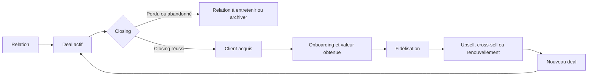

# Filon, plan de transformation produit

**Version de cadrage : 21 juillet 2026**  
**Statut : décisions produit structurantes validées**  
**Objet : document de transmission à un expert produit, métier, UX et système d'information**

## 1. Résumé exécutif

Filon ne doit plus évoluer comme une juxtaposition de pages de CRM, de veille, de documents et d'outils IA. La refonte doit en faire un système personnel de suivi relationnel qui calcule un plan d'action à partir des priorités, des deals et de la santé des relations, puis entretient une boucle commerciale continue après chaque closing.

Le principe directeur validé est :

> Chaque relation. La bonne action. Au bon moment.

La règle opérationnelle centrale est :

> Filon génère et maintient une prochaine action datée pour chaque deal actif. L'utilisateur garde le contrôle pour la valider, la replanifier ou la remplacer.

La transformation repose sur cinq changements de fond :

1. La relation devient la mémoire permanente. L'opportunité devient un deal orienté vers un résultat.
2. Filon établit le plan d'action quotidien à partir des priorités et des deals. L'utilisateur n'a pas à reconstruire manuellement une liste de tâches.
3. Le pipeline est raccourci et normalisé, tandis que des parcours métier adaptent les jalons visibles.
4. Les besoins du client deviennent des données structurées, modifiables et historisées qui pilotent les deals, les actions et l'upsell.
5. Le copilote devient contextuel dans toutes les pages. Le chat reste secondaire.
6. Le closing réussi transforme la relation en client acquis, immédiatement réintroduit dans une boucle de fidélisation, renouvellement et upsell.
7. La tarification passe de cinq paliers techniques à trois offres individuelles compréhensibles, puis une offre Équipe distincte.

## 2. Contexte actuel de l'application

### Positionnement observé

Filon est actuellement présenté comme un SaaS de pilotage des opportunités de revenu pour développeurs et freelances, tout en couvrant déjà plusieurs profils : freelance, consultant, ambassadeur, commercial, agent immobilier, agent d'assurance, recruteur et chercheur d'emploi.

Cette polyvalence n'est pas un problème en elle-même. Le problème vient de l'absence d'un dénominateur métier suffisamment explicite. Ce dénominateur est désormais défini :

> Filon sert les personnes dont une relation bien suivie peut produire une opportunité.

### Stack et architecture observées

- Frontend React 19 avec TanStack Start et Vite.
- Backend Convex pour les données, fichiers, fonctions, crons et fonctionnalités IA.
- Authentification Better Auth.
- Paiement Paystack, avec carte récurrente et mobile money ponctuel.
- Interface Tailwind CSS v4 et composants shadcn/ui.
- Internationalisation française et anglaise.
- Copilote avec crédits, modes de modèles, permissions et journal d'actions.

### Pages principales observées

- Dashboard
- Opportunités
- Pipeline, actuellement redirigé vers Opportunités
- Relances
- Entreprises
- Propositions
- Documents
- Veille
- Copilot
- Organisation
- Parrainage
- Tarifs
- Paramètres

### Diagnostic principal

L'application contient déjà de nombreuses briques utiles, mais leur organisation impose à l'utilisateur de reconstruire lui-même le sens de son activité :

- les relances sont séparées des opportunités et des relations ;
- les entreprises sont séparées du carnet relationnel ;
- les propositions et documents vivent comme des espaces fonctionnels ;
- la veille alimente surtout le cas d'usage emploi ;
- le copilote est encore fortement perçu comme un espace de chat ;
- le dashboard informe, mais ne constitue pas encore un poste de travail quotidien complet ;
- le pipeline utilise des étapes internes fixes qui mélangent plusieurs logiques métier ;
- la tarification vend des quotas et des mécanismes IA plutôt que des résultats utilisateur.

## 3. Cible et positionnement

### Cible prioritaire

La cible prioritaire est l'indépendant qui gère seul entre 20 et 200 relations actives et perd des résultats faute de suivi, de priorisation ou de mémoire relationnelle.

Cette définition couvre naturellement :

- consultants ;
- freelances ;
- commerciaux indépendants ;
- agents immobiliers ou d'assurance ;
- ambassadeurs et professionnels du marketing relationnel ;
- recruteurs indépendants ;
- chercheurs d'emploi avec un cycle d'utilisation potentiellement plus court ;
- apporteurs d'affaires et partenaires.

### Positionnement recommandé

**Catégorie :** système personnel de suivi relationnel.  
**Promesse :** Chaque relation. La bonne action. Au bon moment.  
**Explication :** Filon rassemble les contacts, deals et engagements pour générer chaque jour un plan d'action priorisé, puis relancer la relation jusqu'au closing, à la fidélisation et au prochain upsell.

Le terme CRM peut rester utilisé pour le référencement et les comparaisons, mais il ne doit pas porter la promesse principale.

## 4. Modèle métier cible

### Les trois cycles

#### Cycle Relation

Objectif : identifier, comprendre et entretenir une personne ou une organisation dans la durée.

#### Cycle Deal

Objectif : poursuivre un résultat précis jusqu'au closing, avec une échéance, un parcours et un plan d'action généré par Filon.

#### Cycle Client et croissance

Objectif : transformer chaque closing réussi en relation client durable. Le client devient un prospect acquis auquel Filon doit aider à revendre, via fidélisation, renouvellement, recommandation, upsell, cross-sell ou nouveau deal.

### Règles invariantes

- Une relation peut exister sans opportunité.
- Une relation peut produire plusieurs opportunités successives.
- Une opportunité doit être liée à une relation ou une organisation identifiable.
- Un deal doit être rattaché à au moins un besoin client confirmé ou à confirmer.
- Un besoin client peut évoluer. Il reste modifiable, versionné et relié à ses preuves, interactions et deals.
- Tout deal actif doit recevoir de Filon une prochaine action datée, expliquée et modifiable.
- Toute clôture doit avoir un résultat et une raison.
- Un closing réussi change le statut de la relation en client acquis et ouvre automatiquement la boucle de fidélisation.
- Un client acquis reste une cible commerciale active. Chaque intention d'upsell, de renouvellement ou de cross-sell crée un nouveau deal lié à la même relation.
- Les interactions nourrissent une mémoire relationnelle commune.
- Les données privées restent privées tant qu'elles ne sont pas explicitement partagées.

## 5. Pipeline et parcours métier

### Phases internes communes

1. À qualifier
2. Contact établi
3. Besoin confirmé
4. Solution envisagée
5. Décision en cours
6. Closing
7. Perdue ou abandonnée

Ces phases permettent des analyses cohérentes entre métiers.

### Parcours visibles par opportunité

Le type d'activité appartient à l'opportunité, pas uniquement au profil utilisateur. Une même personne peut donc gérer simultanément plusieurs parcours.

| Parcours | Exemples de jalons visibles |
|---|---|
| Emploi | Candidature, entretien, décision |
| Mission ou conseil | Découverte, proposition, négociation |
| Vente relationnelle | Contact, présentation, décision, intégration |
| Immobilier ou assurance | Qualification, visite ou simulation, offre, signature |
| Recrutement | Identification, entretien, validation, embauche |
| Partenariat | Exploration, alignement, accord, activation |

### Critères de sortie

Une étape représente un fait observable. Elle ne doit pas seulement refléter une impression.

| Étape | Preuve minimale |
|---|---|
| Contact établi | Un échange réel a eu lieu |
| Besoin confirmé | Un besoin, problème ou objectif est renseigné |
| Solution envisagée | Une réponse possible est identifiée |
| Décision en cours | Le décideur ou l'échéance est connu |
| Closing | La décision finale est engagée. Son issue est enregistrée comme closing réussi ou closing perdu |
| Perdue | Une raison de perte est enregistrée |

Après un closing réussi, l'opportunité est clôturée avec son résultat. La relation passe au statut de client acquis et entre dans un parcours de fidélisation. Une nouvelle intention commerciale crée un nouveau deal, sans dupliquer la relation.

### Besoins du client

Les besoins ne doivent pas rester enfermés dans une note libre ou un résumé généré par l'IA. Ils deviennent un objet métier structuré attaché à la relation, puis relié aux deals concernés.

Chaque besoin peut contenir :

- un intitulé modifiable ;
- une description et le résultat attendu ;
- un statut : détecté, à confirmer, confirmé, prioritaire, satisfait, en évolution ou obsolète ;
- une urgence et un impact ;
- une source ou preuve : échange, rendez-vous, document, capture ou saisie manuelle ;
- les deals, offres ou produits associés ;
- une date de confirmation et une date de dernière révision ;
- un historique des modifications.

Filon peut détecter et proposer un besoin depuis une interaction. L'utilisateur peut ensuite le modifier, le fusionner avec un besoin existant, le confirmer, le prioriser ou l'archiver. Une modification importante conserve l'ancienne version afin de comprendre comment le besoin a évolué.

Un nouveau besoin non satisfait chez un client acquis constitue un signal d'upsell ou de nouveau deal. Un besoin satisfait alimente la preuve de valeur, la fidélisation et la recommandation.

Le glisser-déposer reste disponible. Filon affiche un garde-fou léger, demande les informations essentielles et autorise une dérogation motivée.

### Personnalisation encadrée

L'utilisateur peut :

- choisir un modèle métier ;
- renommer les étapes visibles ;
- masquer une étape optionnelle ;
- ajouter des jalons ou listes de contrôle ;
- configurer des délais ;
- enregistrer un modèle personnel.

Il ne peut pas supprimer les invariants : résultat poursuivi, relation, prochaine action, historique, clôture et raison.

## 6. Architecture de navigation cible

### Navigation principale

| Entrée | Question résolue |
|---|---|
| Aujourd'hui | Quel plan d'action Filon a-t-il établi pour moi ? |
| Captures | Qu'est-ce qui vient d'entrer et mérite mon attention ? |
| Relations | Qui est-ce que je connais et quelle est notre histoire ? |
| Opportunités | Quels résultats suis-je en train de poursuivre ? |
| Clients & croissance | À quels clients acquis faut-il revendre, et pourquoi maintenant ? |

### Navigation secondaire

- Analyses
- Bibliothèque
- Organisation
- Paramètres

### Reclassement des pages actuelles

| Page actuelle | Destination cible |
|---|---|
| Dashboard | Aujourd'hui |
| Relances | Actions dans Aujourd'hui et dans les fiches |
| Entreprises | Onglet de Relations |
| Veille | Source automatique dans Captures |
| Propositions | Jalon d'une opportunité et ressource de Bibliothèque |
| Documents | Bibliothèque et pièces jointes contextuelles |
| Copilot | Assistance globale et contextuelle, chat secondaire |
| Pipeline | Vue Kanban d'Opportunités |
| Parrainage Filon | Compte et affiliation |
| Tarifs | Paramètres et déclencheurs contextuels |

## 7. Expérience page par page

### Aujourd'hui

Fonction : plan d'action quotidien généré par Filon. Ce n'est pas une to-do list construite manuellement par l'utilisateur.

Filon compose automatiquement cette vue à partir :

- des deals actifs et de leur phase ;
- des engagements et échéances ;
- de la valeur et de la probabilité ;
- de l'inactivité et du refroidissement relationnel ;
- des parcours métier et de leurs délais recommandés ;
- des signaux post-closing, renouvellement et upsell ;
- des priorités manuelles et préférences de l'utilisateur.

L'utilisateur traite, valide, replanifie ou remplace les actions proposées. Il ne part jamais d'une page blanche.

Doit afficher :

- actions en retard ;
- engagements à tenir aujourd'hui ;
- décisions attendues ;
- relations qui refroidissent ;
- opportunités prioritaires ;
- temps estimé pour traiter la journée ;
- raisons explicites de chaque priorité ;
- progression de la couverture du suivi.

Chaque carte doit permettre d'agir immédiatement, enregistrer le résultat et programmer la suite sans changer plusieurs fois de page.

### Captures

Fonction : point d'entrée universel avant création dans le système.

Sources :

- saisie rapide ;
- URL ;
- texte collé ;
- import de contacts ;
- veille ;
- recommandation ;
- source connectée future.

Traitement :

1. Identifier la personne, l'organisation et le contexte.
2. Rechercher les doublons.
3. Associer ou créer une relation.
4. Déterminer si un résultat est poursuivi.
5. Créer éventuellement une opportunité.
6. Choisir le parcours. Filon génère la prochaine action et sa date, puis l'utilisateur confirme ou ajuste.

Les imports massifs et résultats de veille ne doivent pas polluer automatiquement le pipeline.

### Relations

Fonction : mémoire durable.

Une fiche relation doit regrouper :

- identité et coordonnées ;
- organisations liées ;
- contexte de rencontre et source ;
- historique des interactions ;
- besoins détectés, confirmés, satisfaits et en évolution ;
- opportunités passées et actives ;
- engagements ;
- documents ;
- notes privées et notes partagées clairement distinguées ;
- température calculée et ajustable ;
- prochaine action relationnelle ;
- suggestions de développement.

La section Besoins doit permettre la création et la modification directe, la confirmation d'une suggestion de Filon, la liaison à un deal et la consultation de l'historique des changements.

Les entreprises deviennent une vue organisationnelle des relations, pas un silo séparé.

### Opportunités

Fonction : piloter les résultats poursuivis.

Vues :

- liste opérationnelle ;
- Kanban ;
- calendrier ;
- prévision lorsque les valeurs financières sont pertinentes.

Chaque opportunité doit exposer :

- résultat poursuivi ;
- besoin principal et besoins secondaires concernés ;
- relation concernée ;
- parcours ;
- phase commune ;
- jalons ;
- prochaine action ;
- échéance estimée ;
- importance ;
- confiance ou probabilité ;
- valeur financière facultative ;
- historique et critères manquants.

### Clients & croissance

Fonction : maintenir une boucle commerciale infinie après chaque closing réussi, sans devenir un outil de gestion de projet.

Cas couverts :

- accueil client ;
- intégration d'un filleul ;
- suivi de satisfaction ;
- renouvellement ;
- upsell et cross-sell ;
- recommandation ;
- réachat ;
- activation d'un partenariat ;
- entretien du réseau après une embauche.

Le parcours ne se termine jamais par un simple statut « client ». Filon surveille l'obtention de valeur, la satisfaction, les échéances contractuelles, les signaux d'intérêt et le potentiel d'équipement supplémentaire. Lorsqu'un potentiel est confirmé, Filon crée ou propose un nouveau deal lié au client acquis.

La boucle de croissance compare continuellement les besoins confirmés aux besoins satisfaits, nouveaux ou élargis. C'est cette différence qui doit produire les recommandations de fidélisation et d'upsell.

Filon ne gère pas les sprints, feuilles de temps, tâches de production ou livrables opérationnels.

### Analyses

Hiérarchie des mesures :

1. Qualité du suivi.
2. Progression des relations et opportunités.
3. Closings réussis et croissance des clients acquis.

Indicateurs prioritaires :

- taux de couverture du suivi ;
- actions réalisées à temps ;
- opportunités ayant progressé ;
- temps passé par phase ;
- taux de conversion par parcours ;
- qualité des sources ;
- motifs de perte ;
- relations à risque ;
- closings réussis ;
- taux d'upsell, de cross-sell et de renouvellement ;
- nouveaux deals issus de clients acquis ;
- besoins confirmés, satisfaits et encore non couverts ;
- délai entre détection et confirmation d'un besoin ;
- revenu pondéré seulement lorsque les montants sont fiables.

### Bibliothèque

Fonction : retrouver les ressources sans les déconnecter du travail.

Contenu :

- documents ;
- propositions ;
- modèles ;
- pièces jointes ;
- messages réutilisables.

Chaque ressource reste accessible depuis la relation et l'opportunité correspondantes.

## 8. Moteur de priorité

Le moteur reste explicable et déterministe pour ses signaux principaux. Il ne se contente pas de classer des tâches saisies par l'utilisateur : il génère les actions manquantes à partir de l'état des deals et des parcours.

Signaux recommandés :

- retard ;
- engagement pris ;
- date de décision proche ;
- temps depuis le dernier échange ;
- progression récente ;
- température de la relation ;
- importance ;
- probabilité ;
- valeur potentielle ;
- priorité manuelle ;
- risque de refroidissement.

Niveaux visibles :

1. À traiter maintenant
2. À faire aujourd'hui
3. À préparer cette semaine
4. Sous surveillance

Filon doit toujours expliquer la priorité. L'IA peut proposer l'action ou le message, mais elle ne doit pas constituer l'unique source du classement.

## 9. Interactions et canaux

Filon orchestre les communications sans remplacer WhatsApp, l'e-mail, le téléphone ou l'agenda.

Depuis une prochaine action, l'utilisateur peut :

- ouvrir WhatsApp avec un brouillon ;
- préparer ou envoyer un e-mail ;
- lancer un appel ;
- planifier un rendez-vous ;
- créer une tâche ;
- enregistrer une interaction externe.

Après l'action, une saisie courte enregistre le résultat : pas de réponse, intéressé, à relancer, refus ou autre. Filon met ensuite à jour l'historique, la température et la prochaine action.

## 10. Onboarding et activation

L'onboarding ne doit pas être une visite guidée.

Première réussite attendue :

1. Choisir le résultat actuellement recherché.
2. Capturer une première relation.
3. Créer une opportunité.
4. Choisir le parcours adapté.
5. Planifier la prochaine action.
6. Retrouver cette action dans Aujourd'hui.

L'activation produit est atteinte lorsque ces six événements sont réalisés.

## 11. Rétention et notifications

### Briefing quotidien

Envoyé uniquement lorsqu'il existe des actions pertinentes.

### Alertes événementielles

Limitées aux engagements, décisions proches et relations à risque.

### Revue hebdomadaire

Permet de nettoyer le portefeuille, replanifier, comprendre les blocages et préparer la semaine.

Canaux initiaux : application et e-mail. WhatsApp sortant doit attendre un consentement, une intégration fiable et un modèle économique clair.

## 12. Copilote cible

Le copilote devient une couche contextuelle intégrée.

| Contexte | Assistance attendue |
|---|---|
| Captures | Identifier, enrichir, rapprocher les doublons |
| Relation | Résumer l'histoire et détecter le refroidissement |
| Besoin client | Extraire une hypothèse, demander confirmation et conserver les modifications |
| Opportunité | Générer la prochaine action et expliquer la priorité |
| Rendez-vous | Préparer les objectifs et questions |
| Après interaction | Extraire résultats, engagements et dates |
| Relance | Préparer un message contextuel |
| Aujourd'hui | Enrichir le briefing et aider à exécuter |
| Après closing | Démarrer la fidélisation et détecter le prochain upsell |

### Politique d'autonomie

| Action | Politique |
|---|---|
| Lire, analyser, résumer | Automatique dans le périmètre utile |
| Suggérer une priorité | Automatique et explicable |
| Préparer un brouillon | Automatique |
| Créer une note ou classer une capture | Confirmation légère |
| Modifier une phase ou échéance | Confirmation |
| Envoyer un message externe | Confirmation obligatoire |
| Supprimer ou fermer une relation | Confirmation renforcée |

### Protection des données

- Accès minimal nécessaire à la tâche.
- Journal des accès et actions.
- Séparation des données personnelles et d'équipe.
- Notes privées exclues des analyses d'équipe.
- Protection contre les instructions malveillantes importées.
- Traçabilité des éléments utilisés dans une recommandation.
- Export et suppression des données.
- Données clients non utilisées pour entraîner un modèle public.

## 13. Espaces personnels et équipes

Le carnet personnel est privé par défaut.

Une opportunité d'équipe possède :

- un propriétaire ;
- des collaborateurs éventuels ;
- une organisation ;
- un niveau de visibilité ;
- une relation partagée explicitement ;
- un historique des affectations.

Les managers voient uniquement les données de l'espace organisation : suivi, risques, engagements, conversions et charges. Ils n'accèdent pas implicitement aux relations ou notes personnelles.

## 14. Nouvelle tarification validée

### Découverte, 0 XOF

- 50 relations ;
- 10 opportunités actives ;
- 1 parcours métier ;
- capture manuelle ;
- Aujourd'hui ;
- prochaine action ;
- priorités déterministes ;
- historique essentiel ;
- aperçu limité du copilote ;
- aucun espace d'équipe.

### Pro, 5 000 XOF par mois ou 50 000 XOF par an

- relations et opportunités illimitées ;
- plusieurs parcours ;
- personnalisation encadrée ;
- imports et déduplication ;
- capture multi-source ;
- automatisations ;
- analyses ;
- export ;
- documents et propositions ;
- boucle client, fidélisation et upsell ;
- veille compatible avec les parcours concernés.

### Copilot, 12 000 XOF par mois ou 120 000 XOF par an

- tout Pro ;
- briefing enrichi ;
- résumés relationnels ;
- prochaines actions suggérées ;
- préparation de rendez-vous ;
- extraction des engagements ;
- brouillons contextuels ;
- analyse des risques ;
- enrichissement des captures ;
- usage IA loyal ;
- recharges pour usages exceptionnellement élevés.

### Équipe

Offre distincte, initialement accessible sur demande. Le prix définitif doit être établi après observation de vrais usages. Les membres ne sont plus inclus gratuitement dans Découverte.

### Migration tarifaire

- Conserver temporairement les droits des abonnés existants.
- Maintenir la reconnaissance technique des anciens paliers pendant la transition.
- Appliquer la nouvelle grille d'abord aux nouveaux abonnements.
- Proposer ensuite une migration explicite et avantageuse aux clients existants.
- Garder deux mois offerts en annuel.
- Garder carte récurrente et mobile money ponctuel.
- Présenter l'usage IA en résultats disponibles, pas principalement en crédits.

## 15. Feuille de route de livraison

### Vague 1, fondations métier

- relation permanente ;
- opportunité épisodique ;
- parcours par opportunité ;
- phases communes ;
- prochaines actions ;
- historique des transitions ;
- besoins client structurés, modifiables et historisés ;
- migration additive des données.

**Critère de sortie :** aucune donnée existante perdue et Filon peut générer une prochaine action pour chaque deal actif.

### Vague 2, boucle quotidienne

- nouvelle page Aujourd'hui ;
- moteur de priorité ;
- actions rapides ;
- saisie du résultat ;
- onboarding orienté première action.

**Critère de sortie :** un utilisateur peut traiter sa journée depuis une seule page.

### Vague 3, acquisition relationnelle

- boîte de capture ;
- déduplication ;
- relations et entreprises réunies ;
- imports ;
- veille comme source de capture.

**Critère de sortie :** toute nouvelle piste suit le même circuit de qualification.

### Vague 4, conversion mesurable

- critères de sortie ;
- jalons adaptatifs ;
- besoins reliés aux deals et utilisés dans les critères de progression ;
- personnalisation encadrée ;
- couverture du suivi ;
- analyses par parcours et source.

**Critère de sortie :** les phases reflètent des faits observables et produisent des indicateurs fiables.

### Vague 5, boucle client et croissance

- transformation automatique du closing réussi en client acquis ;
- onboarding et vérification de la valeur obtenue ;
- parcours de fidélisation ;
- renouvellement ;
- upsell et cross-sell ;
- recommandation ;
- réachat et nouveau deal ;
- suivi d'intégration.

**Critère de sortie :** aucun closing réussi ne devient une impasse. Chaque client acquis dispose d'une cadence de fidélisation et d'un prochain potentiel commercial explicite.

### Vague 6, copilote contextuel

- intégration dans chaque page ;
- résumés ;
- préparation ;
- extraction ;
- recommandations ;
- permissions ;
- traçabilité.

**Critère de sortie :** l'utilisateur obtient l'assistance sans devoir ouvrir une conversation générique.

### Vague 7, offre et acquisition

- nouvelle landing ;
- positionnement ;
- nouvelle page Tarifs ;
- nouveaux paliers ;
- migration des abonnements ;
- déclencheurs contextuels d'augmentation de palier.

**Critère de sortie :** chaque offre correspond à un résultat compréhensible et à une limite réellement appliquée.

### Vague 8, équipe

- espaces personnels et partagés ;
- rôles ;
- affectations ;
- supervision ;
- rapports ;
- offre commerciale Équipe.

**Critère de sortie :** aucune donnée personnelle n'est exposée implicitement à l'organisation.

## 16. Mesure de réussite

### Activation

- taux d'utilisateurs créant une première relation ;
- taux créant une première opportunité ;
- taux planifiant une première action ;
- délai jusqu'à la première action exécutée.

### Usage récurrent

- taux de couverture du suivi ;
- utilisateurs traitant Aujourd'hui chaque semaine ;
- actions exécutées à temps ;
- revues hebdomadaires terminées ;
- relations réactivées.

### Résultats

- opportunités ayant progressé ;
- closings réussis ;
- clients acquis réactivés ;
- revenus ou résultats issus d'upsell et de renouvellement ;
- taux de conversion ;
- durée par phase ;
- raisons de perte ;
- nouvelles opportunités provenant d'anciennes relations.

### Économie produit

- conversion Découverte vers Pro ;
- conversion Pro vers Copilot ;
- coût IA par utilisateur Copilot ;
- marge après Paystack et modèles IA ;
- rétention mensuelle par parcours ;
- usage et volonté de payer des équipes.

Les valeurs cibles doivent être fixées après établissement des mesures de référence actuelles. Il ne faut pas inventer des objectifs chiffrés sans données de départ.

## 17. Chantiers temporairement gelés

Jusqu'à livraison de la nouvelle boucle fondamentale :

- nouveaux connecteurs de veille ;
- nouveaux modes IA ;
- raffinements supplémentaires du chat ;
- fonctions avancées d'équipe ;
- nouveaux formats documentaires ;
- ajouts isolés sur les pages destinées à être remplacées.

Restent autorisés : sécurité, paiements, corrections de production, accessibilité, performance, instrumentation et migrations.

## 18. Risques majeurs

### Universalité excessive

Réponse : conserver un modèle commun et adapter les parcours au niveau de l'opportunité.

### Surcharge de saisie

Réponse : capture en moins de dix secondes, enrichissement progressif et exigences uniquement aux transitions importantes.

### Priorités perçues comme arbitraires

Réponse : règles déterministes, explication visible et possibilité d'ajustement.

### IA coûteuse ou intrusive

Réponse : IA contextuelle, accès minimal, autonomie proportionnée au risque et usage suivi.

### Migration destructrice

Réponse : schéma additif, compatibilité temporaire, journal de migration et possibilité de rapprochement manuel.

### Refactorisation interminable

Réponse : vagues verticales avec résultat utilisateur et critère de sortie pour chacune.

## 19. Questions laissées à l'expert externe

Les orientations fondamentales sont validées. L'expert peut désormais contribuer sur des points de précision :

- formulation finale de la catégorie et de la promesse ;
- meilleurs parcours initiaux selon les segments réellement acquis ;
- ordre précis des actions générées dans Aujourd'hui ;
- cadence de fidélisation et signaux déclenchant un upsell ;
- modèle de besoin client, règles de modification et niveau d'historisation ;
- méthode de calcul et de calibration de la température relationnelle ;
- seuils de limitation du palier Découverte ;
- prix et packaging de l'offre Équipe ;
- scénarios d'onboarding à tester ;
- protocole de recherche utilisateur et tests d'utilisabilité ;
- critères de bascule des abonnés historiques ;
- indicateurs de référence à instrumenter avant la refonte.

L'expert ne devrait pas rouvrir sans preuve les décisions structurantes déjà validées. Il devrait surtout les confronter aux comportements réels, identifier les incohérences et améliorer l'exécution.

## 20. Captures disponibles

Le dossier `docs/expert-audit` contient les captures suivantes :

- `filon-public-home.png`
- `filon-page-connexion.png`
- `filon-page-inscription.png`
- `filon-inscription-after-submit.png`
- `filon--app.png`
- `filon--app-opportunites.png`
- `filon--app-pipeline.png`
- `filon--app-relances.png`
- `filon--app-entreprises.png`
- `filon--app-propositions.png`
- `filon--app-documents.png`
- `filon--app-parametres.png`
- `filon-opportunite-form-open.png`
- `filon-opportunite-created2.png`

### Limite du contrôle visuel du 21 juillet 2026

La recapture de la page Tarifs a échoué avant navigation, car le démon `dev-browser` n'a pas démarré. L'audit tarifaire repose donc sur les sources de vérité du code et les captures existantes. Une nouvelle capture desktop et mobile de la page Tarifs devra être ajoutée lorsque le navigateur sera de nouveau opérationnel.

## 21. Définition finale de la transformation

La refonte est réussie lorsqu'un utilisateur peut :

1. Capturer une relation.
2. Décider si elle porte une opportunité.
3. Saisir, confirmer ou modifier le besoin concerné.
4. Choisir le parcours approprié.
5. Recevoir de Filon une prochaine action calculée à partir du deal et du besoin.
6. Retrouver le plan d'action dans Aujourd'hui avec chaque priorité expliquée.
7. Exécuter l'action dans son canal habituel.
8. Enregistrer le résultat en quelques secondes.
9. Faire progresser l'opportunité sur la base d'un fait observable.
10. Atteindre le closing et enregistrer son issue.
11. Transformer automatiquement un closing réussi en client acquis.
12. Comparer les besoins satisfaits et non couverts, détecter un potentiel d'upsell et ouvrir un nouveau deal sans recréer la relation.

Tout élément qui ne renforce pas cette boucle doit être reclassé, reporté ou supprimé de l'expérience principale.
